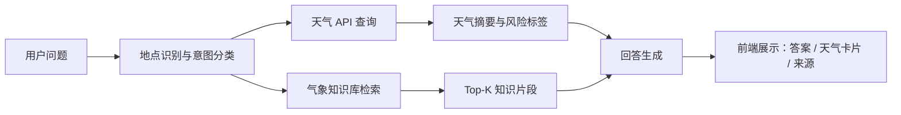

# AI 天气问答 / RAG 知识库 PRD

## 1. 项目定位

AI 天气问答助手面向通勤、出行、户外活动、农业与校园安全等场景，将实时天气 API 与气象知识库结合，提供“天气数据 + 专业解释 + 行动建议 + 知识来源”的问答体验。项目用于展示 RAG 检索增强生成、外部 API 编排、向量检索、可解释答案和前后端工程化能力。

## 2. 背景与问题

普通天气 App 只展示温度、降水、风力等指标，用户仍需要自己判断“是否适合出门”“为什么体感闷热”“雷雨预警该怎么处理”。大型语言模型能解释问题，但如果缺少实时天气和可追溯气象资料，容易产生过时或泛泛的答案。因此本项目通过 RAG 知识库约束回答范围，并通过天气 API 注入实时数据。

## 3. 目标用户

- 城市通勤用户：关心降水、体感温度、风力、紫外线与穿衣建议。
- 户外活动组织者：关心雷暴、阵风、高温、低温、能见度等风险。
- 农业与园艺用户：关心霜冻、降水窗口、土壤湿度、蒸散相关概念。
- 面试官 / 技术评审：关心项目是否具备真实业务闭环、技术深度与可演示性。

## 4. 产品目标

- 支持自然语言提问，例如“上海明天适合骑车吗？”“为什么湿度高会更闷？”
- 自动识别地点，调用天气 API 获取实时/未来天气摘要。
- 从气象文档中检索相关知识片段，生成带引用的解释型回答。
- 在前端展示天气卡片、风险标签、RAG 来源和问答历史。
- 在无 LLM Key 的情况下也能运行演示；配置 LLM 后可升级为生成式回答。

## 5. 核心功能

### 5.1 天气问答

用户输入问题后，系统完成：

1. 地点识别：从问题中识别城市名，默认使用“上海”。
2. 天气查询：调用 Open-Meteo Geocoding 与 Forecast API。
3. 意图分类：判断问题偏向通勤、户外、农业、防灾、科普或综合。
4. RAG 检索：基于问题、天气摘要和意图检索气象知识库。
5. 回答生成：输出结论、依据、建议和参考来源。

### 5.2 实时天气卡片

展示当前温度、体感温度、湿度、降水概率、风速、紫外线、天气状态、更新时间。

### 5.3 风险评估

根据阈值输出风险标签：

- 高温：体感温度 >= 35 摄氏度。
- 强风：阵风或风速 >= 39 km/h。
- 降水：降水概率 >= 60%。
- 紫外线：UV 指数 >= 6。
- 低温：温度 <= 0 摄氏度。

### 5.4 知识来源

每条回答展示命中的知识片段标题、相似度和原文摘要，体现 RAG 可解释性。

### 5.5 演示模式

没有安装 LangChain/Chroma 或没有 LLM Key 时，系统使用本地轻量向量检索和模板化回答，保证作品可离线讲解核心流程。

## 6. 非功能需求

- 可运行：一条命令启动本地服务。
- 可扩展：天气 API、向量库、LLM 均可替换。
- 可解释：回答必须展示数据依据与文档来源。
- 稳定性：API 失败时给出降级提示，不让前端白屏。
- 性能：小规模知识库检索响应控制在 1 秒内；天气 API 取决于网络。

## 7. 技术方案

### 7.1 技术栈

- 后端：Python 3.10+，标准库 HTTP 服务，FastAPI 迁移友好。
- RAG 编排：LangChain/Chroma 可选集成，本地 Hash Embedding + 余弦相似度兜底。
- 向量库：本地 JSON 索引；生产方案可替换为 Chroma、FAISS、Milvus。
- 天气 API：Open-Meteo Geocoding API + Forecast API。
- 前端：HTML/CSS/JavaScript，无构建依赖。

### 7.2 数据流

### 7.3 RAG 策略

- 文档切分：按 Markdown 标题与段落切块。
- 向量表示：本地演示使用关键词 + 中英文 token hash embedding。
- 检索：Top-K 余弦相似度，叠加意图关键词权重。
- 生成：无 Key 使用结构化模板；配置 LLM 后可接 LangChain RetrievalQA 或 LCEL。

## 8. MVP 范围

MVP 必须包含：

- 可运行 Web 界面。
- `/api/ask` 问答接口。
- Open-Meteo 实时天气查询。
- 至少 5 篇气象知识文档。
- RAG 来源展示。
- 简历描述与项目亮点。

暂不包含：

- 用户登录。
- 多轮长期记忆。
- 大规模 PDF 自动解析。
- 商业天气预警 API 付费集成。

## 9. 验收标准

- 启动服务后能打开首页并完成问答。
- 输入“北京明天适合跑步吗？”能返回天气摘要、风险标签、行动建议和来源。
- 输入“为什么湿度高会觉得闷热？”即使不依赖城市天气，也能检索到体感温度/湿度相关知识。
- API 失败时返回明确错误和降级说明。
- README 提供运行方式、架构说明和可放入简历的描述。

## 10. 后续迭代

- 接入 LangChain OpenAI / DeepSeek / 通义等模型。
- 使用 Chroma 持久化向量库并提供 ingest CLI。
- 增加 PDF 气象手册解析。
- 增加历史天气对比和活动计划推荐。
- 增加评测集：事实准确率、引用命中率、建议可用性。
