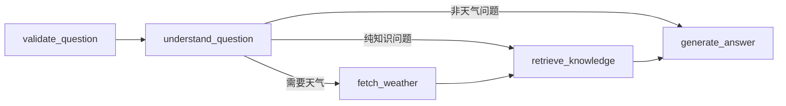

# 户外活动天气风险决策助手

一个面向中国国内户外活动的 AI 天气安全决策项目：结合 Open-Meteo 天气 API、地点级小时预报、气象知识库、向量检索和可解释建议，适合放进简历或作品集。

## 亮点

- 天气 API 编排：自动识别国内城市，调用 Open-Meteo 地理编码与天气预报接口，并使用 `countryCode=CN` 约束查询范围。
- LangGraph 状态图：将问题校验、意图识别、天气查询、RAG 检索、LangChain 答案生成拆成可观测节点。
- LangChain 问答链：将天气数据、风险标签和 RAG 来源组装为提示词；配置 LLM Key 后可调用 OpenAI 兼容大模型，否则使用本地 RAG 兜底。
- RAG 知识库：内置气象文档，返回带来源的回答。
- 领域守卫：非天气、非气象术语、非户外活动天气风险问题会被直接拦截；“广州明天适合吃猪脚饭吗”这类饮食偏好问题不会进入天气 API 或 RAG 检索，但“广州明天出门吃饭要带伞吗”会按天气决策处理。
- 活动计划表：活动评估后可加入计划表，页面打开期间会定时复查计划地点和时间的天气预报；当安全指数下降、预报变差或风险极高时，会在计划表中提示并尝试发送浏览器通知。
- 向量检索：默认使用本地 Hash Embedding + 余弦相似度，零依赖可跑；可扩展到 LangChain + Chroma。
- 可解释输出：答案拆分为结论、天气依据、知识依据、行动建议和引用来源。
- 前端作品化：提供完整 Web UI，可直接用于演示。

## 快速运行

推荐用项目内虚拟环境：

```powershell
cd weather-rag-assistant
python -m venv .venv
.\.venv\Scripts\Activate.ps1
python -m pip install -U pip
python -m pip install langgraph pytest
```

启动服务：

```powershell
cd weather-rag-assistant
python -m src.weather_rag.server
```

打开：

```text
http://127.0.0.1:8765
```

## 本地 EXE 桌面启动

可以打包成一个本地 exe：双击后自动启动本地服务并打开浏览器页面；关闭页面后，网页心跳停止，服务会在十几秒内自动退出。

```powershell
python -m pip install pyinstaller
pyinstaller --onefile --windowed --name "户外活动天气风险决策助手" --add-data "static;static" --add-data "data;data" desktop_launcher.py
```

生成文件在：

```text
dist/户外活动天气风险决策助手.exe
```

## 手机端 App 打包

项目已提供 Capacitor Android App 壳和自定义图标。App 启动后会先让你填写天气服务地址，再进入同一套手机端页面。

安装依赖并生成 Android 工程：

```powershell
npm install
npm run mobile:sync
```

如果本机已安装 Android Studio / Android SDK，可继续构建调试 APK：

```powershell
npm run mobile:build
```

APK 输出位置：

```text
android/app/build/outputs/apk/debug/app-debug.apk
```

如果本机没有 Java 或 Android SDK，也可以推送到 GitHub 后在 Actions 页面运行 `Build Android Debug APK`，构建完成后下载 artifact：`outdoor-weather-risk-assistant-debug-apk`。

真机使用时，需要让电脑服务监听局域网地址，并把 App 里的服务地址填成电脑 IP：

```powershell
$env:WEATHER_SERVER_HOST="0.0.0.0"
python -m src.weather_rag.server
```

然后在手机 App 中填写类似：

```text
http://192.168.1.20:8765
```

Android 模拟器可直接使用默认地址：

```text
http://10.0.2.2:8765
```

页面状态接口会返回 `orchestrator=langgraph` 和 `answer_backend`。如果配置了大模型 API Key，`answer_backend=langchain-llm`；如果没有 Key，则为 `langchain-local-rag`，表示使用 LangChain 组织上下文，但答案由本地 RAG 兜底生成。

## 可选：接入大模型 API

默认项目不内置任何 API Key，也不会偷偷调用外部大模型。要让“问天气AI”真正调用大模型，需要配置 OpenAI 兼容接口：

```powershell
$env:WEATHER_LLM_API_KEY="你的 API Key"
$env:WEATHER_LLM_MODEL="gpt-4o-mini"
# 如使用第三方 OpenAI 兼容服务，再配置：
$env:WEATHER_LLM_BASE_URL="https://你的服务地址/v1"
python -m src.weather_rag.server
```

配置后可访问健康检查确认：

```text
http://127.0.0.1:8765/api/health
```

其中 `llm.connected=true` 表示问答已经接入大模型；`false` 表示当前仍是本地 RAG 兜底。

测试接口：

```powershell
Invoke-RestMethod -Method Post `
  -Uri http://127.0.0.1:8765/api/ask `
  -ContentType "application/json" `
  -Body '{"question":"北京明天适合跑步吗？"}'
```

## 怎么使用这个问答助手

1. 启动后打开 `http://127.0.0.1:8765`。
2. 在输入框里问中国国内城市的自然语言问题，例如：
   - `上海明天适合骑车吗？`
   - `北京今天适合跑步吗？`
   - `为什么湿度高会觉得闷热？`
   - `农业喷药为什么要避开大风和降雨？`
   - `广州明天适合骑车吗？`
3. 页面会返回四类信息：
   - 回答：结论、天气依据、风险标签、行动建议。
   - 天气数据：温度、体感、湿度、降水概率、风速、UV。
   - 风险标签：高温、强风、降水、紫外线、低温等。
   - RAG 来源：命中的气象知识片段、相似度和摘要。

也可以直接调用接口：

```powershell
$body = @{ question = "上海明天适合骑车吗？" } | ConvertTo-Json
Invoke-RestMethod -Method Post `
  -Uri http://127.0.0.1:8765/api/ask `
  -ContentType "application/json; charset=utf-8" `
  -Body $body
```

返回里的 `graph` 字段会展示 LangGraph 执行轨迹：

```json
{
  "backend": "langgraph",
  "trace": [
    "validate_question",
    "understand_question",
    "fetch_weather",
    "retrieve_knowledge",
    "generate_answer"
  ]
}
```

## LangGraph 状态图



节点职责：

- `validate_question`：清洗问题，拦截空输入。
- `understand_question`：识别城市、意图和今天/明天时段，同时执行领域判断；无关问题会直接进入边界提示，不检索知识库。
- `fetch_weather`：调用 Open-Meteo API 并计算目标时段风险。
- `retrieve_knowledge`：组合问题、天气摘要和风险标签，检索气象知识库。
- `generate_answer`：生成带天气依据、知识依据和行动建议的回答。

## 可选：Chroma 向量库方案

当前默认检索使用本地 Hash Embedding，确保没有 LLM Key 也能演示。如果要升级成更标准的 Chroma 向量库实现，可安装：

```powershell
pip install -r requirements.txt
```

然后在 `src/weather_rag/langchain_pipeline.py` 中接入 Chroma 持久化索引。当前项目已经使用 LangChain 组织答案生成链路，并保留 Chroma 检索器适配层。

## 项目结构

```text
weather-rag-assistant/
  PRD.md
  README.md
  requirements.txt
  data/weather_docs/       # 气象知识库
  static/                  # Web 前端
  src/weather_rag/         # 后端、天气 API、RAG 检索
  tests/                   # 单元测试
```

## API 说明

### POST `/api/ask`

请求：

```json
{
  "question": "上海明天适合骑车吗？"
}
```

返回：

```json
{
  "answer": "...",
  "location": "上海",
  "weather": {},
  "risks": [],
  "sources": []
}
```

### GET `/api/health`

返回服务状态、文档数量和索引状态。

## 简历写法

项目名称：户外活动天气风险决策助手

项目描述：

> 设计并实现一套面向骑行、徒步、露营等场景的户外天气安全决策助手，结合实时天气 API 与气象知识库，通过 RAG 检索增强生成可解释答案。系统支持地点级天气拉取、安全指数计算、多时段推荐、知识片段引用和移动端可视化展示，在无 LLM Key 的情况下也能通过本地向量检索完成稳定演示。

技术栈：

> Python、LangGraph、LangChain、RAG、本地向量检索、OpenAI 兼容 LLM API、Open-Meteo API、HTML/CSS/JavaScript

简历要点：

- 基于 LangGraph 设计天气问答状态图，将问题理解、天气 API、风险评估、RAG 检索和 LangChain 答案生成拆分为可观测节点。
- 搭建 RAG 问答链路，将气象知识文档切块、向量化并按 Top-K 相似度召回，为天气建议提供可追溯来源。
- 使用 LangChain 将天气数据、风险标签和检索来源组装为问答链，支持配置 OpenAI 兼容 API 后调用真实大模型生成回答。
- 增加非天气领域拦截，避免美食、代码、历史等无关问题误检索气象知识库并产生偏题回答。
- 封装 Open-Meteo 地理编码与天气预报接口，使用中国城市范围过滤，实现国内城市识别、实时天气摘要和降水/强风/高温/紫外线风险标签。
- 设计无 Key 可演示的降级方案，使用本地 Hash Embedding 与模板生成保证项目在面试环境稳定运行。
- 实现前后端一体化 Web Demo，展示问答、天气指标、引用来源和系统状态，提升作品集可展示性。

## 数据来源

- Open-Meteo Forecast API: https://open-meteo.com/en/docs
- Open-Meteo Geocoding API: https://open-meteo.com/en/docs/geocoding-api
