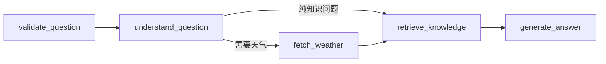

# AI Weather RAG Assistant

一个面向中国国内城市的 AI 天气问答 / RAG 知识库项目：结合 Open-Meteo 天气 API、气象知识库、向量检索和可解释回答，适合放进简历或作品集。

## 亮点

- 天气 API 编排：自动识别国内城市，调用 Open-Meteo 地理编码与天气预报接口，并使用 `countryCode=CN` 约束查询范围。
- LangGraph 状态图：将问题校验、意图识别、天气查询、RAG 检索、答案生成拆成可观测节点。
- RAG 知识库：内置气象文档，返回带来源的回答。
- 向量检索：默认使用本地 Hash Embedding + 余弦相似度，零依赖可跑；可扩展到 LangChain + Chroma。
- 可解释输出：答案拆分为结论、天气依据、知识依据、行动建议和引用来源。
- 前端作品化：提供完整 Web UI，可直接用于面试演示。

## 快速运行

推荐用项目内虚拟环境：

```powershell
cd E:\Unity\ProjectML\jianli\weather-rag-assistant
python -m venv .venv
.\.venv\Scripts\Activate.ps1
python -m pip install -U pip
python -m pip install langgraph pytest
```

启动服务：

```powershell
cd E:\Unity\ProjectML\jianli\weather-rag-assistant
python -m src.weather_rag.server
```

打开：

```text
http://127.0.0.1:8765
```

页面左上方状态会显示 `langgraph · 6 片段`，说明当前已经启用 LangGraph 状态图。如果没有安装 LangGraph，项目会显示 `linear-fallback`，仍可演示基础问答，但简历版建议安装 LangGraph。

测试接口：

```powershell
Invoke-RestMethod -Method Post `
  -Uri http://127.0.0.1:8765/api/ask `
  -ContentType "application/json" `
  -Body '{"question":"北京明天适合跑步吗？"}'
```

## 怎么使用这个问答助手

1. 启动后打开 `http://127.0.0.1:8765`。
2. 在输入框里问中国国内城市的自然语言问题，例如：
   - `上海明天适合骑车吗？`
   - `北京今天适合跑步吗？`
   - `为什么湿度高会觉得闷热？`
   - `农业喷药为什么要避开大风和降雨？`
   - `广州明天适合骑车吗？`
3. 页面会返回四类信息：
   - 回答：结论、天气依据、风险标签、行动建议。
   - 天气数据：温度、体感、湿度、降水概率、风速、UV。
   - 风险标签：高温、强风、降水、紫外线、低温等。
   - RAG 来源：命中的气象知识片段、相似度和摘要。

也可以直接调用接口：

```powershell
$body = @{ question = "上海明天适合骑车吗？" } | ConvertTo-Json
Invoke-RestMethod -Method Post `
  -Uri http://127.0.0.1:8765/api/ask `
  -ContentType "application/json; charset=utf-8" `
  -Body $body
```

返回里的 `graph` 字段会展示 LangGraph 执行轨迹：

```json
{
  "backend": "langgraph",
  "trace": [
    "validate_question",
    "understand_question",
    "fetch_weather",
    "retrieve_knowledge",
    "generate_answer"
  ]
}
```

## LangGraph 状态图



节点职责：

- `validate_question`：清洗问题，拦截空输入。
- `understand_question`：识别城市、意图和今天/明天时段。
- `fetch_weather`：调用 Open-Meteo API 并计算目标时段风险。
- `retrieve_knowledge`：组合问题、天气摘要和风险标签，检索气象知识库。
- `generate_answer`：生成带天气依据、知识依据和行动建议的回答。

## 可选：LangChain / Chroma 方案

当前默认检索使用本地 Hash Embedding，确保没有 LLM Key 也能演示。如果要升级成更标准的 LangChain + Chroma 向量库实现，可安装：

```powershell
pip install -r requirements.txt
```

然后在 `src/weather_rag/langchain_pipeline.py` 中接入 Chroma 持久化索引和 LLM。当前项目已经保留了适配层与迁移说明，面试时可以说明“本地检索为演示兜底，生产方案替换为 LangChain + Chroma + LLM”。

## 项目结构

```text
weather-rag-assistant/
  PRD.md
  README.md
  requirements.txt
  data/weather_docs/       # 气象知识库
  static/                  # Web 前端
  src/weather_rag/         # 后端、天气 API、RAG 检索
  tests/                   # 单元测试
```

## API 说明

### POST `/api/ask`

请求：

```json
{
  "question": "上海明天适合骑车吗？"
}
```

返回：

```json
{
  "answer": "...",
  "location": "上海",
  "weather": {},
  "risks": [],
  "sources": []
}
```

### GET `/api/health`

返回服务状态、文档数量和索引状态。

## 简历写法

项目名称：AI 天气问答与气象 RAG 知识库

项目描述：

> 设计并实现一套面向出行与户外决策的 AI 天气问答系统，结合实时天气 API 与气象知识库，通过 RAG 检索增强生成可解释答案。系统支持城市识别、天气数据拉取、风险标签计算、知识片段引用和 Web 可视化展示，在无 LLM Key 的情况下也能通过本地向量检索完成稳定演示。

技术栈：

> Python、LangGraph、LangChain 思路、Chroma 可扩展向量库、RAG、Open-Meteo API、HTML/CSS/JavaScript

简历要点：

- 基于 LangGraph 设计天气问答状态图，将问题理解、天气 API、风险评估、RAG 检索和答案生成拆分为可观测节点。
- 搭建 RAG 问答链路，将气象知识文档切块、向量化并按 Top-K 相似度召回，为天气建议提供可追溯来源。
- 封装 Open-Meteo 地理编码与天气预报接口，使用中国城市范围过滤，实现国内城市识别、实时天气摘要和降水/强风/高温/紫外线风险标签。
- 设计无 Key 可演示的降级方案，使用本地 Hash Embedding 与模板生成保证项目在面试环境稳定运行。
- 实现前后端一体化 Web Demo，展示问答、天气指标、引用来源和系统状态，提升作品集可展示性。

## 数据来源

- Open-Meteo Forecast API: https://open-meteo.com/en/docs
- Open-Meteo Geocoding API: https://open-meteo.com/en/docs/geocoding-api
